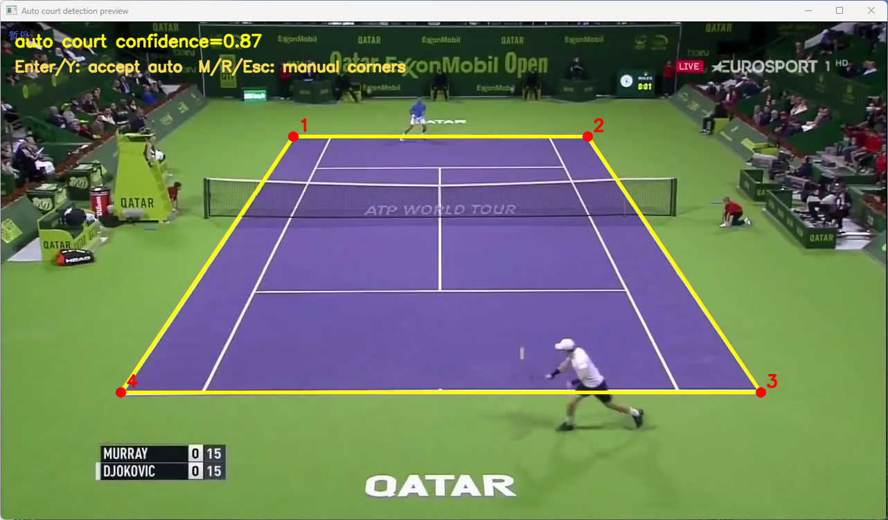
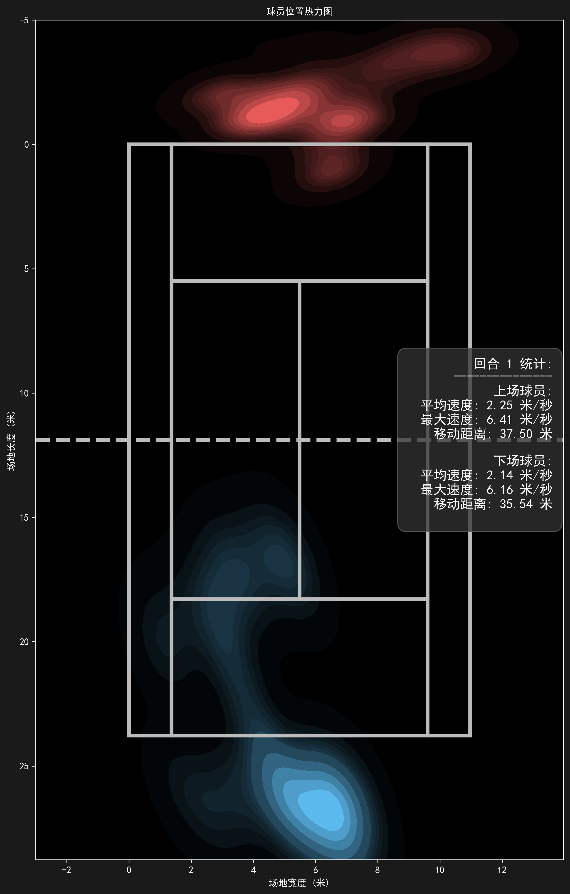
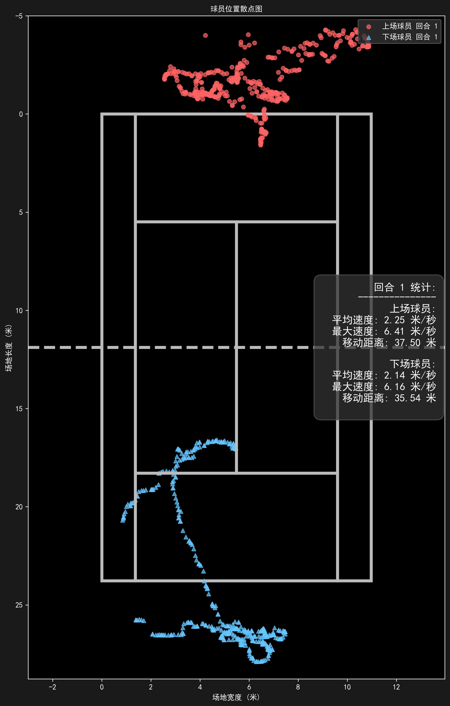

# Good-Tennis: AI 网球鹰眼系统 🎾

<div align="center">

[](https://github.com/yo-WASSUP/Good-Tennis/blob/main/LICENSE)

**基于计算机视觉的网球比赛视频分析工具**

[中文](README.md) | [English](README_en.md)

</div>

### 🎬 视频分析结果

| RTMPose 姿态检测 | YOLO26s 人体检测 |
| --- | --- |
|  |  |
网球比赛远景里球员通常较小，目标检测一般比姿态估计更稳定。

## 📝 更新日志

- **2026-06-22**：整理开源 README，增加网球弹跳点检测。
- **当前版本**：支持球员检测、网球检测、球场坐标映射、轨迹统计、回合检测、小地图、热力图/散点图和带标注视频输出。
- **实验功能**：自动球场外角点检测和网球弹跳点检测仍在迭代中，适合研究和二次开发使用。

## 🗺️ 开发计划

- [x] 网球比赛视频逐帧分析
- [x] YOLO 人体检测和多姿态模型支持
- [x] YOLO 网球检测模型接入
- [x] 手动/自动球场标注与球场坐标映射
- [x] 球员移动轨迹、速度、距离和回合统计
- [x] 网球轨迹和弹跳点标注
- [x] 标准球场小地图叠加
- [x] 中文 / 英文可视化文字
- [x] 热力图、散点图和检测数据导出
- [ ] 更稳定的网球弹跳点识别
- [ ] 更精确的网球检测模型
- [ ] 更完整的击球点和技术动作统计
- [ ] 批量视频分析工作流

---

## ✨ 功能

- **球员检测** - 默认使用 YOLO 人体框检测，也可切换到 RTMPose、RTMO 或 Ultralytics YOLO Pose 姿态估计。
- **网球检测** - 使用 YOLO 模型检测网球位置；原始检测写入数据文件，最终视频绘制后处理过滤/插值后的干净轨迹。
- **球场标注** - 默认尝试自动检测双打外角点，失败后切换为手动点击四个外角点。
- **球场坐标映射** - 将图像坐标映射到标准双打网球场坐标，球场尺寸按 `10.97m x 23.77m` 建模。
- **球员位置追踪** - 记录球员球场坐标、移动轨迹、速度和距离。
- **回合检测** - 根据连续球场视图自动判断回合开始和结束，并在视频叠加层和检测数据中记录回合编号。
- **弹跳点检测** - 视频处理完成后，按整段网球轨迹做离群点清理、插值、速度计算，默认使用规则评分；干净球轨迹和弹跳点会在主画面和小地图上显示。
- **小地图叠加** - 在输出视频中显示标准网球场小地图，标注球员、网球和弹跳点位置。
- **位置图表** - 自动生成球员位置热力图和散点图。
- **中英文显示** - 可通过 `--language zh/en` 切换可视化文字。
- **本地运行** - 视频、模型和分析结果都保存在本地。


### 📊 球场与位置可视化

| 自动球场检测 | 球员位置热力图 | 球员位置散点图 |
| --- | --- | --- |
|  |  |  |

## 🧩 系统要求

- Python 3.8+
- FFmpeg，并已加入系统 `PATH`
- OpenCV / PyTorch / Ultralytics / RTMLib / ONNX Runtime
- 推荐 NVIDIA GPU；CPU 可以运行，但视频分析速度会明显变慢

## ⚙️ 安装指南

### Windows

```bash
python -m venv .venv
.\.venv\Scripts\activate
python -m pip install --upgrade pip
pip install -r requirements.txt
```

### Linux / macOS

```bash
python -m venv .venv
source .venv/bin/activate
python -m pip install --upgrade pip
pip install -r requirements.txt
```

### GPU 加速（Windows / NVIDIA）

默认依赖使用 CPU 版 PyTorch 和 ONNX Runtime。需要 GPU 加速时，先确认：

- 已安装 NVIDIA 显卡驱动，`nvidia-smi` 可以正常输出显卡信息。
- 推荐使用 CUDA 12.1 对应的 PyTorch wheel。
- 如果遇到 DLL 加载失败，先安装或修复 Microsoft Visual C++ Redistributable 2015-2022 x64。

PowerShell：

```bash
.\.venv\Scripts\activate

pip uninstall -y torch torchvision onnxruntime
pip install torch==2.5.1+cu121 torchvision==0.20.1+cu121 --index-url https://download.pytorch.org/whl/cu121
pip install onnxruntime-gpu==1.20.1
```

验证 GPU 是否生效：

```bash
python -c "import torch; print('torch:', torch.__version__); print('cuda:', torch.cuda.is_available()); print('gpu:', torch.cuda.get_device_name(0) if torch.cuda.is_available() else 'not available')"
python -c "import onnxruntime as ort; print(ort.__version__); print(ort.get_available_providers())"
```

期望看到：

```text
cuda: True
CUDAExecutionProvider
```

切回 CPU 版：

```bash
pip install --force-reinstall -r requirements.txt
```

## 🧠 模型准备

首次运行前，请到项目的 GitHub Release 页面下载权重文件：

```text
https://github.com/yo-WASSUP/Good-Tennis/releases/latest
```

下载后把所有权重文件放到项目根目录下的 `weights/` 文件夹

如果缺少默认权重，程序会在启动时提示对应文件不存在。也可以通过 `--ball-model`、`--person-model`、`--yolo-pose-model` 指定自己的模型路径。

网球检测默认读取网球 YOLO 权重。

球员检测模型由 `--player-detector` 切换。默认 `yolo-person`，使用 YOLO 人体框检测，并取检测框底部中点作为球员位置。

本地 RTMPose / RTMO 文件不存在时，`rtmlib` 可能会尝试在线下载到用户缓存目录。

## 🚀 使用指南

### 第一次运行流程

1. 准备输入视频，并从 [GitHub Releases](https://github.com/yo-WASSUP/Good-Tennis/releases/latest) 下载权重到 `weights/`。
2. 运行基础命令：

```bash
python main.py --video-path videos/demo.mp4 --template-path templates/demo.png
```

3. 程序会先尝试自动检测网球双打场地四个外角点。
4. 检测到候选球场线时会显示预览窗口，并保存 `outputs/<视频文件名>/auto_court_preview.png` 供检查。
5. 按 `Enter`/`Y` 接受自动结果，按 `M`/`R`/`Esc` 切换到手动四角标注。
6. 手动标注时，按顺序点击左上、右上、右下、左下四个外角点。
7. 标注结果会保存到 `outputs/<视频文件名>/court_annotations.txt`。同一个输出目录下再次运行会复用这个文件。
8. 分析结束后，查看 `outputs/<视频文件名>/detect_<视频文件名>.mp4`、`detections.jsonl` 和 `position_visualizations/`。

如果换了视频视角、裁切方式或模板图，需要删除对应输出目录里的 `court_annotations.txt`，重新标注四点。

### 球员检测方式

默认使用 YOLO 人体框检测：

```bash
python main.py --video-path videos/demo.mp4 --template-path templates/demo.png --person-model weights/yolo26s.pt
```

切换到姿态估计：

```bash
python main.py --video-path videos/demo.mp4 --template-path templates/demo.png --player-detector pose --pose-family rtmpose
```

使用 Ultralytics YOLO Pose：

```bash
python main.py --video-path videos/demo.mp4 --template-path templates/demo.png --player-detector pose --pose-family yolo-pose --yolo-pose-model weights/yolo11s-pose.pt
```

### 回合检测说明

程序会用球场模板图做比赛视图判断，并自动维护回合状态：

- 连续多帧匹配到球场视图时，判定新回合开始。
- 连续多帧没有匹配到球场视图时，判定当前回合结束。
- 回合编号会写入 `detections.jsonl`，并显示在输出视频的统计叠加层中。
- 每个回合开始时会重置该回合内的移动距离、速度等统计，整场统计继续累计。
- 这个逻辑依赖模板图和四点球场标注；如果模板图选得不准，回合切分也会不准。

### 常用参数

```text
--video-path                    输入视频路径，默认 videos/game9_Clip3.mp4
--output-dir                    输出目录，默认 outputs/<视频文件名>
--ball-model                    YOLO 网球检测模型路径，默认 weights/tennis-ball.pt
--pose-family                   姿态模型族：rtmpose、rtmo 或 yolo-pose
--pose-mode                     RTMPose / RTMO 档位：lightweight、balanced、performance
--yolo-pose-model               YOLO pose 模型路径或模型名，默认 weights/yolo11s-pose.pt
--player-detector               球员检测方式：yolo-person 或 pose，默认 yolo-person
--person-model                  YOLO 人体检测模型路径或模型名，默认 weights/yolo26s.pt
--template-path                 球场模板图路径；不传时会弹出文件选择框
--court-detection               球场角点检测方式：manual、auto、auto-fallback，默认 auto-fallback
--pose-roi true|false           是否显示姿态检测 ROI 框，默认 true
--display true|false            是否显示 OpenCV 预览窗口，默认 true
--skeletons true|false          是否显示人体骨架，默认 true
--player-trajectories true|false 是否显示球员轨迹，默认 true
--court-trajectory true|false   是否显示球场轨迹叠加层，默认 true
--tennis-ball-trajectory true|false 是否显示网球轨迹，默认 true
--bounce-detection true|false   是否检测并标注网球弹跳点，默认 true
--mini-map true|false           是否显示球场小地图，默认 true
--player-stats true|false       是否显示球员统计信息，默认 true
--save-images                   保存处理后的每帧图像
--performance-stats             打印性能耗时
--visualize-positions true|false 是否生成热力图和散点图，默认 true
--audio true|false              是否保留原视频音频，默认 true
--language {zh,en}              选择界面语言
```

## 📦 输出结果

默认输出到 `outputs/<视频文件名>/`：

- `metadata.json`：视频、模型、球场标注和输出文件元数据。
- `detections.jsonl`：逐帧检测记录，包含回合编号、球员、手部、球场坐标、速度、网球坐标和后处理弹跳点事件。
- `bounce_events.json`：整段轨迹后处理得到的弹跳点列表，包含帧号、图像坐标、置信度和诊断信息。
- `cleaned_ball_trajectory.json`：过滤和短缺失插值后的球轨迹，最终视频使用这份轨迹绘制。
- `detect_<视频文件名>.mp4`：带骨架、轨迹、统计信息、小地图和回合编号叠加层的输出视频。
- `court_annotations.txt`：球场标注坐标缓存。
- `auto_court_preview.png`：自动球场检测预览图，触发自动检测候选时生成。
- `position_visualizations/heatmaps/`：球员位置热力图。
- `position_visualizations/scatter_plots/`：球员位置散点图。

## 🗂️ 项目结构

```text
main.py                    # 命令行入口和参数解析
requirements.txt           # 唯一依赖安装入口
tennis_analysis/
├── system.py              # 视频分析主流程 TennisAnalysisSystem
├── court/                 # 球场标注与坐标映射
├── data/                  # JSON / JSONL 输出
├── detection/             # 网球检测、球员检测和姿态检测
├── media/                 # 视频音频处理
├── tracking/              # 球员、网球轨迹和回合追踪
└── visualization/         # 视频叠加层、统计图和位置图
```

## 🙏 致谢

感谢 RTMPose、RTMO 和 OpenMMLab 生态提供的姿态估计算法基础，以及 [Tau-J/rtmlib](https://github.com/Tau-J/rtmlib) 提供的轻量姿态估计运行库。
感谢 [Ultralytics](https://github.com/ultralytics/ultralytics) 提供的 YOLO 目标检测算法与工具链。
感谢 [yastrebksv/TrackNet](https://github.com/yastrebksv/TrackNet) 项目整理并公开网球数据集，为本项目的网球检测与轨迹分析提供了重要参考。

## 许可证

本项目代码使用 Apache License 2.0。随项目使用的第三方模型权重许可证以其实际来源为准。
