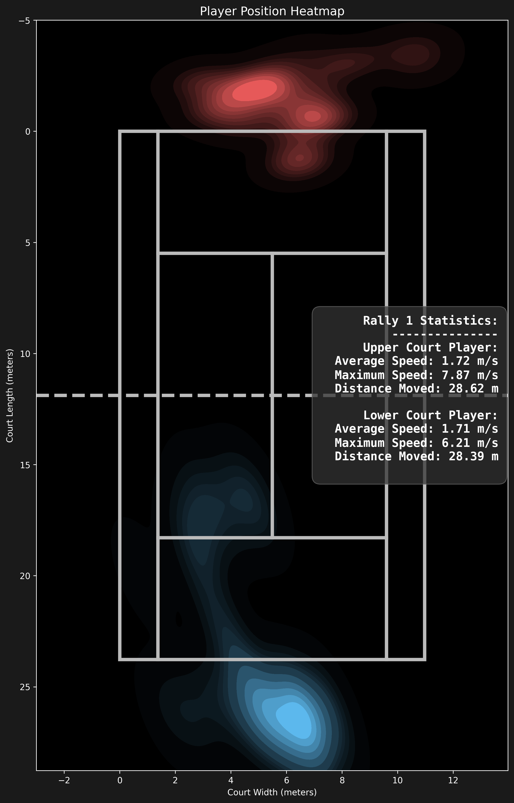
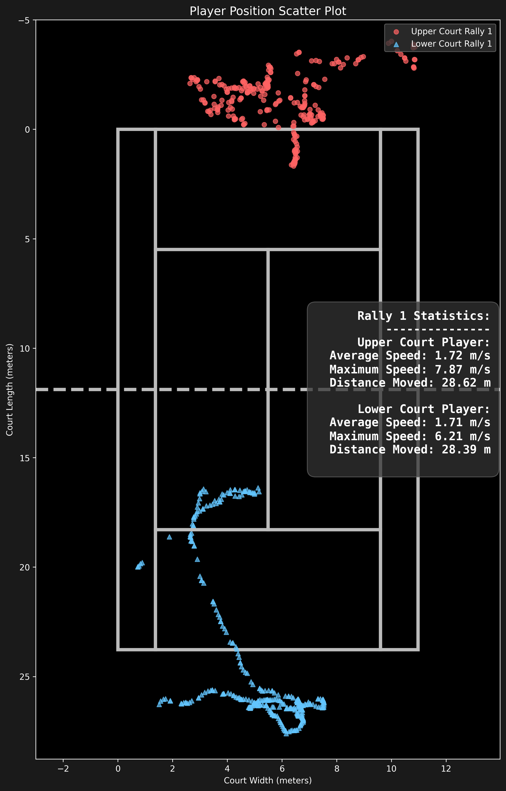

# Good-Tennis: AI Tennis Match Analysis Assistant 🎾

<div align="center">

[](https://github.com/yo-WASSUP/Good-Tennis/blob/main/LICENSE)

**A computer-vision-based tennis match video analysis tool**

[Chinese](README.md) | [English](README_en.md)

</div>

### 🎬 Video Analysis Results

| RTMPose Pose Detection | YOLO26s Person Detection |
| --- | --- |
|  |  |

## 📝 Changelog

- **2026-06-25**: Added tennis ball speed measurement. Each shot is segmented and its peak speed (km/h) is estimated, written to `ball_speed.json`, and overlaid on the video as a speed panel.
- **2026-06-22**: Organized the open-source README and added tennis ball bounce detection.
- **Current version**: Supports player detection, tennis ball detection, court coordinate mapping, trajectory statistics, rally detection, mini-map overlays, heatmaps/scatter plots, and annotated video output.
- **Experimental features**: Automatic outer court corner detection and tennis ball bounce detection are still being improved, and are suitable for research and further development.

## 🗺️ Roadmap

- [x] Frame-by-frame tennis match video analysis
- [x] YOLO person detection and multiple pose model options
- [x] YOLO tennis ball detection integration
- [x] Manual/automatic court annotation and court coordinate mapping
- [x] Player movement trajectories, speed, distance, and rally statistics
- [x] Tennis ball trajectory and bounce point annotation
- [x] Tennis ball speed measurement (peak speed per shot, km/h)
- [x] Standard tennis court mini-map overlay
- [x] Chinese / English visualization text
- [x] Heatmaps, scatter plots, and detection data export
- [ ] More stable tennis ball bounce point recognition
- [ ] More accurate tennis ball detection model
- [ ] More complete hit point and stroke technique statistics
- [ ] Batch video analysis workflow

---

## ✨ Features

- **Player detection** - Uses YOLO person bounding boxes by default, and can also switch to RTMPose, RTMO, or Ultralytics YOLO Pose for pose estimation.
- **Tennis ball detection** - Uses a YOLO model to detect tennis ball positions; raw detections are written to data files, while the final video draws the cleaned trajectory after post-processing, filtering, and interpolation.
- **Court annotation** - Tries to automatically detect the four outer doubles court corners by default, and falls back to manual corner clicks if detection fails.
- **Court coordinate mapping** - Maps image coordinates to a standard doubles tennis court coordinate system modeled as `10.97m x 23.77m`.
- **Player position tracking** - Records player court coordinates, movement trajectories, speed, and distance.
- **Rally detection** - Automatically detects rally start/end from consecutive court-view frames, and records rally IDs in both the video overlay and detection data.
- **Bounce point detection** - After video processing, the full tennis ball trajectory is cleaned, interpolated, and scored by rules by default; the cleaned ball trajectory and bounce points are drawn on the main frame and mini-map.
- **Ball speed measurement** - Using the cleaned trajectory, shots are segmented by bounce points and rally gaps, and each shot's peak speed (km/h) is estimated from court-plane coordinates (meters). A speed panel is overlaid on the video and results are written to `ball_speed.json`. A single camera only yields the 2D court-plane projection, so the measured speed underestimates the true 3D ball speed; flat drives are more accurate than high lobs.
- **Mini-map overlay** - Displays a standard tennis court mini-map in the output video, with player, ball, and bounce point positions.
- **Position charts** - Automatically generates player position heatmaps and scatter plots.
- **Chinese / English display** - Visualization text can be switched with `--language zh/en`.
- **Local processing** - Videos, models, and analysis results are all stored locally.

### 📊 Court and Position Visualizations

| Automatic Court Detection | Player Position Heatmap | Player Position Scatter Plot |
| --- | --- | --- |
|  |  |  |

## 🧩 Requirements

- Python 3.8+
- FFmpeg added to the system `PATH`
- OpenCV / PyTorch / Ultralytics / RTMLib / ONNX Runtime
- NVIDIA GPU recommended; CPU execution works, but video analysis will be significantly slower

## ⚙️ Installation

### Windows

```bash
python -m venv .venv
.\.venv\Scripts\activate
python -m pip install --upgrade pip
pip install -r requirements.txt
```

### Linux / macOS

```bash
python -m venv .venv
source .venv/bin/activate
python -m pip install --upgrade pip
pip install -r requirements.txt
```

### GPU Acceleration (Windows / NVIDIA)

The default dependencies use CPU builds of PyTorch and ONNX Runtime. For GPU acceleration, first confirm:

- NVIDIA GPU driver is installed and `nvidia-smi` works.
- CUDA 12.1 PyTorch wheels are recommended.
- If DLL loading fails, install or repair Microsoft Visual C++ Redistributable 2015-2022 x64.

PowerShell:

```bash
.\.venv\Scripts\activate

pip uninstall -y torch torchvision onnxruntime
pip install torch==2.5.1+cu121 torchvision==0.20.1+cu121 --index-url https://download.pytorch.org/whl/cu121
pip install onnxruntime-gpu==1.20.1
```

Verify GPU availability:

```bash
python -c "import torch; print('torch:', torch.__version__); print('cuda:', torch.cuda.is_available()); print('gpu:', torch.cuda.get_device_name(0) if torch.cuda.is_available() else 'not available')"
python -c "import onnxruntime as ort; print(ort.__version__); print(ort.get_available_providers())"
```

Expected output includes:

```text
cuda: True
CUDAExecutionProvider
```

Switch back to CPU builds:

```bash
pip install --force-reinstall -r requirements.txt
```

## 🧠 Model Weights

Before the first run, download the model weights from the project's GitHub Release page:

```text
https://github.com/yo-WASSUP/Good-Tennis/releases/latest
```

Put all downloaded weight files into the `weights/` folder under the project root, and keep the following default paths unchanged:

```text
weights/tennis-ball.pt
weights/yolo26s.pt
weights/yolo11s-pose.pt
weights/yolox_nano_8xb8-300e_humanart-40f6f0d0.onnx
weights/rtmpose-s_simcc-body7_pt-body7_420e-256x192-acd4a1ef_20230504.onnx
weights/rtmo-s_8xb32-600e_body7-640x640-dac2bf74_20231211.onnx
```

If a default weight file is missing, the program will report the missing file at startup. You can also pass custom model paths with `--ball-model`, `--person-model`, and `--yolo-pose-model`.

Tennis ball detection reads the tennis ball YOLO weight by default:

```text
weights/tennis-ball.pt
```

The player detection model is selected with `--player-detector`. The default is `yolo-person`, which uses YOLO person bounding boxes and takes the bottom center of the box as the player position.
In wide-angle tennis match footage, players are usually small, so object detection is generally more stable than pose estimation.

Pose estimation can use local ONNX files:

```text
weights/yolox_nano_8xb8-300e_humanart-40f6f0d0.onnx
weights/rtmpose-s_simcc-body7_pt-body7_420e-256x192-acd4a1ef_20230504.onnx
weights/rtmo-s_8xb32-600e_body7-640x640-dac2bf74_20231211.onnx
```

If local RTMPose / RTMO files are missing, `rtmlib` may try to download them into the user cache directory.

## 🚀 Usage

### First Run

1. Prepare an input video, and download weights from [GitHub Releases](https://github.com/yo-WASSUP/Good-Tennis/releases/latest) into `weights/`.
2. Run the basic command:

```bash
python main.py --video-path videos/demo.mp4 --template-path templates/demo.png
```

3. The program will first try to automatically detect the four outer corners of the doubles tennis court.
4. If candidate court lines are detected, a preview window will be shown and `outputs/<video_name>/auto_court_preview.png` will be saved for inspection.
5. Press `Enter`/`Y` to accept the automatic result, or press `M`/`R`/`Esc` to switch to manual four-corner annotation.
6. During manual annotation, click the four outer corners in order: top-left, top-right, bottom-right, bottom-left.
7. The annotation result is saved to `outputs/<video_name>/court_annotations.txt`. Future runs in the same output directory will reuse this file.
8. After analysis, check `outputs/<video_name>/detect_<video_name>.mp4`, `detections.jsonl`, and `position_visualizations/`.

If the video camera angle, crop, or template image changes, delete `court_annotations.txt` in the corresponding output directory and annotate the four points again.

### Player Detection Modes

Use YOLO person detection by default:

```bash
python main.py --video-path videos/demo.mp4 --template-path templates/demo.png --person-model weights/yolo26s.pt
```

Switch to pose estimation:

```bash
python main.py --video-path videos/demo.mp4 --template-path templates/demo.png --player-detector pose --pose-family rtmpose
```

Use Ultralytics YOLO Pose:

```bash
python main.py --video-path videos/demo.mp4 --template-path templates/demo.png --player-detector pose --pose-family yolo-pose --yolo-pose-model weights/yolo11s-pose.pt
```

### Rally Detection

The program uses the court template image to determine whether the current frame is a match view, and automatically maintains rally state:

- A new rally starts after multiple consecutive frames match the court view.
- The current rally ends after multiple consecutive frames no longer match the court view.
- Rally IDs are written to `detections.jsonl` and shown in the output video stats overlay.
- Movement distance, speed, and other per-rally statistics reset at the start of each rally; match-level statistics continue accumulating.
- This logic depends on the template image and four-point court annotation. If the template is inaccurate, rally segmentation will also be inaccurate.

### Common Arguments

```text
--video-path                    Input video path, default videos/game9_Clip3.mp4
--output-dir                    Output directory, default outputs/<video_name>
--ball-model                    YOLO tennis ball detection model path, default weights/tennis-ball.pt
--pose-family                   Pose model family: rtmpose, rtmo, or yolo-pose
--pose-mode                     RTMPose / RTMO mode: lightweight, balanced, performance
--yolo-pose-model               YOLO pose model path or model name, default weights/yolo11s-pose.pt
--player-detector               Player detector: yolo-person or pose, default yolo-person
--person-model                  YOLO person detection model path or model name, default weights/yolo26s.pt
--template-path                 Court template image path; opens a file picker if omitted
--court-detection               Court corner detection mode: manual, auto, auto-fallback, default auto-fallback
--pose-roi true|false           Show pose detection ROI box, default true
--display true|false            Show OpenCV preview window, default true
--skeletons true|false          Show human skeletons, default true
--player-trajectories true|false Show player trajectories, default true
--court-trajectory true|false   Show court trajectory overlay, default true
--tennis-ball-trajectory true|false Show tennis ball trajectory, default true
--bounce-detection true|false   Detect and annotate tennis ball bounce points, default true
--ball-speed true|false         Measure and display ball speed (km/h), default true
--mini-map true|false           Show court mini-map, default true
--player-stats true|false       Show player statistics, default true
--save-images                   Save processed frames
--performance-stats             Print performance timing
--visualize-positions true|false Generate heatmaps and scatter plots, default true
--audio true|false              Keep original video audio, default true
--language {zh,en}              Visualization language
```

## 📦 Outputs

Default output directory: `outputs/<video_name>/`

- `metadata.json`: Metadata for the video, models, court annotation, and output files.
- `detections.jsonl`: Frame-by-frame detection records, including rally ID, players, hands, court coordinates, speed, tennis ball coordinates, and post-processed bounce events.
- `bounce_events.json`: Bounce point list produced by full-trajectory post-processing, including frame index, image coordinates, confidence, and diagnostics.
- `cleaned_ball_trajectory.json`: Ball trajectory after filtering and short-gap interpolation; the final video uses this trajectory for drawing.
- `ball_speed.json`: Ball speed measurement results, including per-shot peak/average speed (km/h), shot frame, court coordinates, and match-level max/average shot speed.
- `detect_<video_name>.mp4`: Output video with skeletons, trajectories, statistics, mini-map, and rally ID overlays.
- `court_annotations.txt`: Cached court annotation coordinates.
- `auto_court_preview.png`: Automatic court detection preview image, generated when automatic candidates are available.
- `position_visualizations/heatmaps/`: Player position heatmaps.
- `position_visualizations/scatter_plots/`: Player position scatter plots.

## 🗂️ Project Structure

```text
main.py                    # CLI entry and argument parsing
requirements.txt           # Single dependency installation entry
tennis_analysis/
├── system.py              # Main video analysis workflow: TennisAnalysisSystem
├── court/                 # Court annotation and coordinate mapping
├── data/                  # JSON / JSONL outputs
├── detection/             # Tennis ball, player, and pose detection
├── media/                 # Video and audio processing
├── tracking/              # Player, tennis ball trajectory, and rally tracking
└── visualization/         # Video overlays, statistics charts, and position plots
```

## 🙏 Acknowledgements

Thanks to RTMPose, RTMO, and the OpenMMLab ecosystem for the pose estimation algorithm foundation, and to [Tau-J/rtmlib](https://github.com/Tau-J/rtmlib) for the lightweight pose estimation runtime.
Thanks to [Ultralytics](https://github.com/ultralytics/ultralytics) for the YOLO object detection algorithm and toolchain.
Thanks to [yastrebksv/TrackNet](https://github.com/yastrebksv/TrackNet) for organizing and publishing the tennis dataset, which provides important reference material for tennis ball detection and trajectory analysis in this project.

## License

This project is licensed under the Apache License 2.0. Third-party model weights are governed by their respective original licenses.
